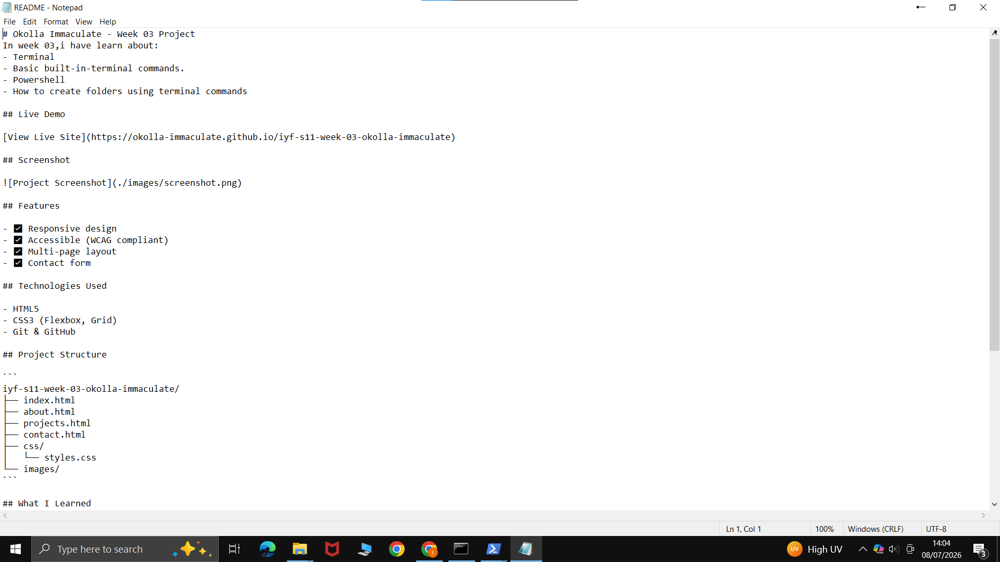

# Okolla Immaculate - Week 03 Project
In week 03,i have learn about:
- Terminal
- Basic built-in-terminal commands.
- Powershell
- How to create folders using terminal commands

## Live Demo

[View Live Site](https://okolla-immaculate.github.io/iyf-s11-week-03-okolla-immaculate)

## Screenshot



## Features

- ✅ Responsive design
- ✅ Accessible (WCAG compliant)
- ✅ Multi-page layout
- ✅ Contact form

## Technologies Used

- HTML5
- CSS3 (Flexbox, Grid)
- Git & GitHub

## Project Structure

```
iyf-s11-week-03-okolla-immaculate/
├── index.html
├── about.html
├── projects.html
├── contact.html
├── css/
│   └── styles.css
└── images/
```

## What I Learned

cd.. this command takes you back to c:Users/User
The Cmd has different comands compared to windows powershell.
gitignore allows git to ignore files and not show them in commands history.

## Future Improvements

- [ ] Add JavaScript interactivity
- [ ] Implement dark mode
- [ ] Add project filtering

## Contact

- Email:immaculateokolla@email.com
- LinkedIn: [OKolla Immaculate](https://linkedin.com/in/immaculate-okolla-299004269)
- GitHub: [@okolla-Immaculate](https://github.com/okolla-immaculate)

## License

This project is open source and available under the [MIT License](LICENSE).